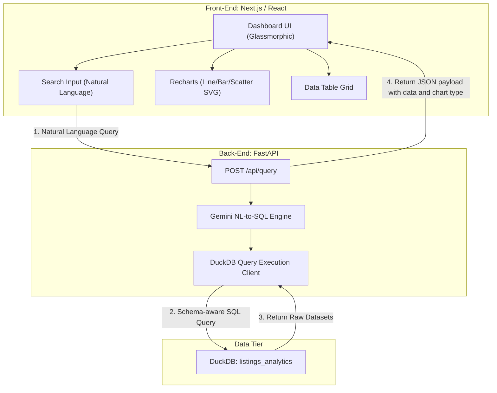

# 🌌 Blocket Analytics Web - Technical Blueprint
## 💡 Executive Summary

**Blocket Analytics Web** is a premium, web-based analytics portal designed to translate natural language user questions (e.g. *"Show me the average price of Yamaha MT-07 by model year"* or *"What are the top 5 most common motorcycle brands currently active?"*) into clean, execute-ready SQL. 

The system runs these queries directly against our **DuckDB** analytical database, executes high-fidelity data transformations, and returns interactive tables and animated charts in a beautiful dark glassmorphism dashboard.

---

## 🛠️ Selected Technology Stack

The project uses a split-stack architecture to ensure maximum modularity, fast API queries, and ultimate visual quality:

### 1. Front-end (Next.js & React)
* **Framework**: Next.js (App Router, TypeScript, React 19) for fast routing and premium client rendering.
* **Styling**: Tailwind CSS with custom glassmorphism overrides and smooth hover micro-animations.
* **Typography**: Outfit & Inter fonts imported via `next/font` for high-end digital agency appearance.
* **Visualization**: **Recharts** (fully responsive React wrapper for SVG charts) for highly interactive, animated line, bar, scatter, and area graphs.
* **Icons**: Lucide React.

### 2. Back-end (FastAPI & DuckDB)
* **Framework**: FastAPI (Python 3.10+) providing asynchronous REST API endpoints.
* **Database**: Local or remote SSH DuckDB connection, targeting the analytical view `listings_analytics`.
* **Natural Language Engine**: **Gemini 1.5 Flash** (highly responsive, low-latency) or **Gemini 1.5 Pro** (advanced SQL syntax generator).
* **Validation**: Pydantic v2.

### 🌐 Architectural Stack Visualization



---

## 📂 Project Directory Structure

```text
blocket-analytics-web/
├── package.json               # Next.js, Tailwind, Recharts, and TypeScript dependencies
├── tsconfig.json              # TypeScript compilation rules
├── tailwind.config.js         # Tailored dark-mode colors & glassmorphism utilities
├── next.config.js             # Client configurations
│
├── app/                       # App Router Directories
│   ├── layout.tsx             # HTML body, fonts, and dark theme background
│   ├── page.tsx               # Dashboard Portal (Search bar, chart, and table widgets)
│   └── globals.css            # Base Tailwind imports & custom gradients
│
├── components/                # Modular React Elements
│   ├── QueryInput.tsx         # Sleek natural language search field with animated glows
│   ├── AnalyticsChart.tsx     # Dynamic data visualizer (renders Bar/Line/Pie based on LLM suggestions)
│   └── AnalyticsTable.tsx     # Modern interactive data matrix (pagination, sorting)
│
├── backend/                   # FastAPI Server
│   ├── main.py                # Router, CORS configs, and endpoint setup
│   ├── requirements.txt       # fastapi, uvicorn, duckdb, google-generativeai, pydantic
│   ├── database.py            # Local DuckDB copy/read pipeline
│   └── translator.py          # AI SQL Translator (feeds schema metadata to Gemini)
│
└── run_dev.sh                 # 🚀 Shell script to boot both Next.js and FastAPI servers concurrently
```

---

## 🤖 Natural Language to SQL Translation Engine

To ensure that the Gemini model produces syntactically flawless SQL that conforms to our DuckDB schema, the translator module passes the exact table definitions and indexes as system context.

### The System Prompt & Schema Definition

```python
# backend/translator.py System Prompt template
SYSTEM_PROMPT = """
You are an expert DuckDB database translator. Your job is to take a natural language question in English or Swedish and convert it into a valid, highly optimized DuckDB SQL query.

Target Table Schema (listings_analytics view):
- id: VARCHAR (Unique listing ID)
- title: VARCHAR (Listing title)
- url: VARCHAR (Source link)
- location: VARCHAR (Location in Sweden)
- seller_type: VARCHAR ('private' or 'dealer')
- published_at: TIMESTAMP
- created_year: INTEGER
- created_month: INTEGER
- status: VARCHAR ('active' or 'removed')
- is_active: BOOLEAN (TRUE if ad is currently active)
- removed_at: TIMESTAMP
- price_sek: INTEGER (Ad price in SEK)
- brand: VARCHAR (Motorcycle brand, e.g. Yamaha, Honda, BMW, Harley-Davidson)
- model: VARCHAR (Motorcycle model, e.g. MT-07, R1, GS)
- model_year: INTEGER (Year of vehicle manufacture)
- mileage_km: INTEGER (Total mileage)
- engine_cc: INTEGER (Engine size in cubic centimeters)
- gearbox: VARCHAR ('Manuell', 'Automat', etc.)
- fuel_type: VARCHAR ('Bensin', 'El', etc.)
- vehicle_type: VARCHAR (e.g. 'MC-skoter', 'Offroad', 'Sport')
- reg_number: VARCHAR (Swedish vehicle registration plate number)
- dealer_name: VARCHAR (Name of dealer, if seller_type is dealer)
- dealer_location: VARCHAR (Dealer location)
- price_update_count: INTEGER (Number of times price has changed)
- min_price_sek: INTEGER (Minimum recorded price)
- max_price_sek: INTEGER (Maximum recorded price)

Guidelines:
1. Return ONLY a valid JSON object matching the requested schema. No conversational preamble.
2. DuckDB SQL is standard ANSI SQL. Use string functions case-insensitively using ILIKE where appropriate (e.g. brand ILIKE '%yamaha%').
3. Filter by is_active = TRUE unless the user asks for historical or removed listings.
4. Recommend a chart type ('bar', 'line', 'pie', 'scatter', or 'table' if chart is inappropriate) depending on the dimensions of the data.
5. Limit queries to a maximum of 100 rows to ensure snappy UI rendering.

You must return a JSON response matching this exact Pydantic schema:
{
  "sql_query": "SELECT brand, COUNT(*) FROM listings_analytics WHERE is_active = TRUE GROUP BY brand ORDER BY 2 DESC LIMIT 10",
  "explanation": "Summarizes what data is queried and why.",
  "recommended_chart": "bar",
  "x_axis_key": "brand",
  "y_axis_key": "count"
}
"""
```

---

## 🔌 API Endpoint Interface

### `POST /api/query`
Receives the natural language query and orchestrates translation, execution, and return of the formatted results:

```json
// Request Payload
{
  "user_query": "Compare the average price of BMW vs Honda motorcycles by year"
}

// Response Payload
{
  "success": true,
  "sql_query": "SELECT brand, model_year, AVG(price_sek) as avg_price FROM listings_analytics WHERE is_active = TRUE AND (brand ILIKE '%bmw%' OR brand ILIKE '%honda%') GROUP BY brand, model_year ORDER BY model_year ASC",
  "explanation": "Calculates the average listing price for BMW and Honda motorcycles grouped by manufacture year.",
  "columns": ["brand", "model_year", "avg_price"],
  "rows": [
    { "brand": "Honda", "model_year": 2018, "avg_price": 54000 },
    { "brand": "BMW", "model_year": 2018, "avg_price": 89000 },
    { "brand": "Honda", "model_year": 2019, "avg_price": 61000 },
    { "brand": "BMW", "model_year": 2019, "avg_price": 95000 }
  ],
  "visualization": {
    "recommended_chart": "line",
    "x_axis_key": "model_year",
    "y_axis_key": "avg_price",
    "series_key": "brand"
  }
}
```

---

## 🎨 UI Mockup & Dashboard Layout

The portal is designed with a premium, sleek dark mode theme (`bg-[#0B0F19]`) utilizing high-end CSS indicators:

* **Top Search Hub**: A centered, glowing command-bar interface with a soft turquoise gradient ring.
* **Metrics Snapshot**: Micro cards showcasing count of parsed active records, updated prices, and pending AI appraisal scores.
* **Visualization Deck**: An animated window that loads dynamic SVG Recharts (e.g. custom tooltips, curved line joints, and sleek gradients instead of flat blocks).
* **Raw Data Grid**: A clean, glassmorphic data table below the chart showing the exact output rows with direct search filtering and column Sorting.

---

## 🏁 Development Setup & Run Command

To make starting both developers' environments easy, a `run_dev.sh` orchestrates the frontend installation, FastAPI virtualenv setup, and handles multi-process launching:

```bash
#!/usr/bin/env bash
# run_dev.sh
# Orchestrates concurrent starting of Next.js and FastAPI services.

echo "🚀 --- Starting Blocket Web Analytics Setup ---"

# 1. Start FastAPI Backend
cd backend
if [ ! -d "venv" ]; then
    echo "📦 Creating virtual environment..."
    python3 -m venv venv
    source venv/bin/activate
    pip install -r requirements.txt
else
    source venv/bin/activate
fi

python3 main.py &
BACKEND_PID=$!

# 2. Start Next.js Frontend
cd ../
if [ ! -d "node_modules" ]; then
    echo "📦 Installing npm dependencies..."
    npm install
fi

npm run dev &
FRONTEND_PID=$!

# Handle shutdown
trap "kill $BACKEND_PID $FRONTEND_PID; exit" INT TERM EXIT
wait
```
