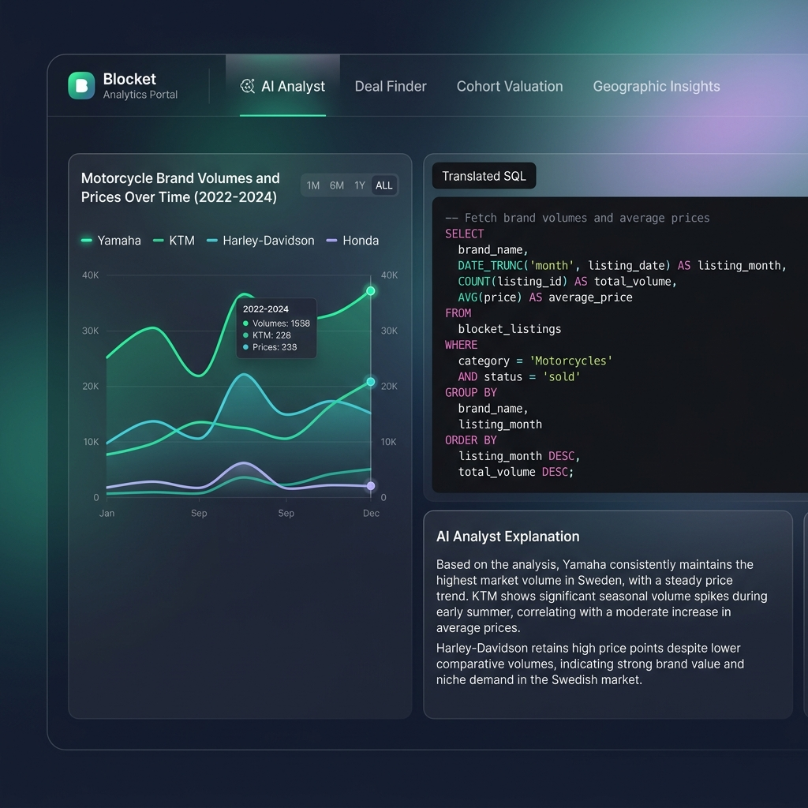
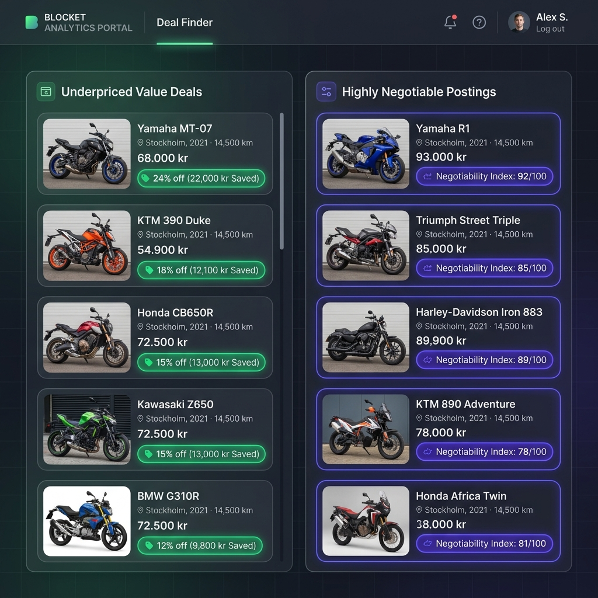

# 🌌 Blocket Analytics Portal

The **Blocket Analytics Portal** is a full-stack analytical dashboard built to query, visualize, and appraise the Swedish motorcycle market. It translates natural language questions into secure DuckDB SQL queries in real-time, executing them and charting the findings dynamically.

---

## 🎨 Interactive Interface Mockups
Below are the high-fidelity user interface mockups for the key tabs in the portal:

### 🔍 AI Analyst View

### ⚡ Deal Finder View

---

## ⚙️ Tech Stack & Architecture
* **Frontend**: Next.js (TypeScript) + TailwindCSS for sleek dark glassmorphism (glass-panel backdrops) and Lucide-React icon packs.
* **Charts**: Recharts-based dynamic data visualization (supporting Line, Bar, Pie, Scatter, and Table layouts).
* **Backend**: FastAPI (Python) running on port `8000`.
* **Database Engine**: DuckDB for sub-millisecond analytical aggregations on crawled listing files.
* **Natural Language Compiler**: Gemini 2.5 compiling user questions to DuckDB SQL.

---

## 🧩 Portal Tab Specifications

### 1. 🔍 AI Analyst (`analytics`)
Allows users to type open-ended queries (e.g., *"Show the average mileage and price of Touring motorcycles"*). The AI compiles it into SQL, logs the query for transparency, and renders:
* **Interactive Chart**: Recharts visualization based on data classification.
* **Data Grid**: Complete scrollable dataset.
* **Analyst Insights**: Human-readable text summary of the results.

### 2. ⚡ Deal Finder (`deals`)
Scans database metrics and ranks active motorcycle listings by their "deal score" (measuring listing price against cohort averages). Identifies under-priced listings instantly.

### 3. 🧮 Cohort Valuation (`calculator`)
A pricing calculator that lets users input motorcycle specifications (Brand, Model, Year, Mileage, Engine Size) to receive a calculated appraisal score based on historical market trends.

### 4. 🗺️ Geographic Insights (`geo`)
Maps listing densities, volume, and average price ranges across Swedish regions (e.g., Stockholm, Västra Götaland, Skåne) to locate geographic pricing arbitrage opportunities.
